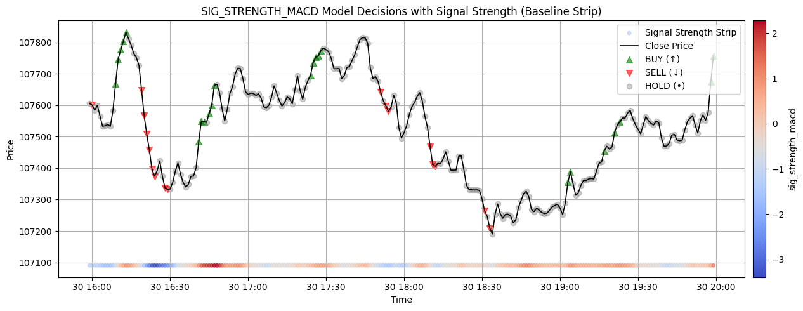

# Silent\_Horizon

> **A regime-aware, multi-model crypto signal engine combining handcrafted technical intuition with machine learning precision.**

---

## 📌 Project Overview

**Silent\_Horizon** is a full-stack quantitative trading pipeline designed to generate actionable BUY/HOLD/SELL signals on short-term Bitcoin price movements.

We designed two complementary trading strategies in this project:

1. **Oracle + Regression Model**: A regime-specialized ensemble using XGBoost regressors trained on log-return oracles
2. **Classification Model**: A direct classification model built for fast directional prediction

This project is built from the ground up to:

* 📈 Detect meaningful patterns using handcrafted technical signals
* 🧠 Train regime-aware XGBoost regressors and classifiers for directional prediction
* 🔗 Aggregate predictions via a meta-model ensemble (regression)
* 📊 Backtest predictions under realistic trading assumptions
* 🧪 Perform thorough hyperparameter and threshold tuning
* ✅ Save and deploy models for future live trading integration

It was designed with care to ensure **data leakage prevention**, **causality preservation**, and **realistic execution constraints**.

---

## 🧠 Core Methodology

### 1. Signal Engineering (Domain Intuition)

We compute **6 key signal strength indicators**, each derived from well-known technical concepts:

| Signal  | Intuition                        | Description                          |
| ------- | -------------------------------- | ------------------------------------ |
| `rsi`   | Mean-reversion potential         | Normalized distance from neutral RSI |
| `macd`  | Momentum divergence              | MACD line − Signal line              |
| `obv`   | Volume-backed confirmation       | OBV z-score                          |
| `vwap_` | Price vs institutional consensus | Percent deviation from VWAP          |
| `roc`   | Speed of movement                | Price rate-of-change over 10 steps   |
| `adx`   | Trend strength and direction     | (+DI - -DI) magnitude                |

Each signal is **z-normalized** to ensure comparability across regimes.

### 2. Regime Filtering and Strong Sample Extraction

Instead of training on all data, we extract strong regimes using signal-specific quantiles:

```python
strong_mask = (signal < q_low) | (signal > q_high)
```

This provides focused training regions where the signal shows high conviction.

### 3. Regime-Specific XGBoost Regressors

We train one `XGBRegressor` per signal using strong-slice data:

* **Features:** Raw engineered + regime cluster ID
* **Target:** Non-leaky forward log return

```python
future_mean = mean(price[t+1:t+h])
past_mean   = mean(price[t-h:t-1])
Target = log(future_mean / past_mean)
```



Each model’s output is analyzed via MAE, R², and class accuracy (buy/sell/hold bins).

### 4. Clustering-Based Regime Feature

We enhance the feature set by appending a `cluster` label (from K-Means over price and volume) to represent:

* ⬆️ Bullish Regimes
* ⬇️ Bearish Regimes
* 🔁 Volatile Sideways Regimes


---

## 🧠 Meta-Ensemble Learning (Stacked Model)

All 6 trained regressors are used to generate **out-of-sample predictions** for unseen data. These predictions are appended to the feature matrix of raw inputs to train a final **meta-regressor**:

* `X = [features, clusters, model_preds]`
* `y = forward return`
* Meta Model: `XGBRegressor`

```python
Train R2: 0.9404 | MAE: 0.000094
Test  R2: 0.9809 | MAE: 0.000044
Classification Accuracy (Buy/Sell/Hold): ~92%
```

### 📊 SHAP Analysis:

SHAP values confirm the influence of both technical signals and model predictions in the meta-model, validating the multi-layer architecture.


---

## 🎯 Threshold Optimization (Buy/Sell Tuning)

While the models output continuous values, trading needs discrete actions.

We used **Optuna** to tune thresholds:

* Parameters: `buy_thresh`, `sell_thresh`
* Objective: `multiplier + 0.1 * sharpe`
* Evaluated over 10 random 5-day windows
* Metric Stability: Robust Sharpe + Return across splits

This allows us to trade conservatively, even under volatile periods.

---

## 🧪 Classification Model (Version 1 Baseline)

The first version of the pipeline used pure **classification models**:

* One `XGBClassifier` per signal trained on directional labels:

  * BUY if forward return > +threshold
  * SELL if < -threshold
  * HOLD otherwise

* Each classifier predicted BUY/HOLD/SELL labels using signal-filtered training data

* Performance measured using class-wise hit rates and distribution stability

### Visualization and Results:

We plotted classification model predictions over real price movement:

* Background hue strip showed the signal strength
* Predictions visualized as arrows (BUY ↑, SELL ↓, HOLD •)
* Increasing the **safety multiplier** helped mitigate false positives

Classification models showed high local accuracy in strong signal regimes. However, due to:

* Lack of nuanced reward targeting
* Crude position sizing (fixed class labels)

…they yielded slightly lower cumulative returns and Sharpe ratios during backtest compared to the regression ensemble.

Still, they remain useful for:

* Fast prototyping
* Voting ensembles
* Hard-threshold binary signals

---

## 🔬 Evaluator Function: Realistic Performance Measurement

We also defined `evaluate_strategy()` to:

* Choose a random 5-day window
* Compute cumulative returns, hourly Sharpe
* Sample over multiple runs (Optuna-ready)

This allows fast tuning and robust offline evaluation of various strategy configurations.

---

## 🔁 Backtesting

We simulate **realistic execution** using a position-based model:

* Positions ∈ {1 (BUY), 0 (HOLD / Take Profit), -1 (SELL)}
* Execution through Marker Orders

### Position Change Logic:

```python
cash += old_position * price  # square off
cash -= new_position * price  # new position
pnl = cash + new_position * price
```

### Smoothed Positioning:

To avoid jittery trading, we use rolling smoothing over the position signal before computing PnL.

### Results (Meta-Classification):

* Final PnL Multiplier: ~ **1.4×** over 7 days

### Visuals:

* Price chart with BUY/SELL markers
* Cumulative PnL chart with returns annotation


---

## 📦 Model Deployment

We save every trained model for deployment:

* ✅ 6 Regime Regressors
* ✅ Meta-Regressor (tuned)
* ✅ 6 Signal Classifiers (optional)

Saved using `joblib` under:

```
saved_models/regime_models/{model_name}_xgb.pkl
```

These can be loaded in real-time inference or paper-trading loops.

---

## 📚 Future Work

* ⚙️ Add Alpaca live paper trading hooks
* 📶 Stream real-time indicators and inference
* 🧪 Auto-adaptive threshold retraining every 6 hours
* 📉 Include slippage and transaction costs in backtest
* 🔄 Consider LSTM smoothing for signal noise reduction

---

## ✅ Summary

**Silent\_Horizon** is a fully modular crypto trading system combining:

* 🧠 Technical Analysis features (interpretable)
* 🏗️ Regime-specific regressors & classifiers
* 🔗 Meta-ensemble model
* 📊 Smooth realistic backtesting
* 📈 Optuna-based optimization

All models are:

* 📦 Saved and reusable
* 🔒 Causally aligned (no leakage)
* 📉 Validated using realistic assumptions

> "Built with patience. Trained with precision. Tuned for power."

---

**Stack**: Python · XGBoost · Optuna · SHAP · Pandas · NumPy · Matplotlib
