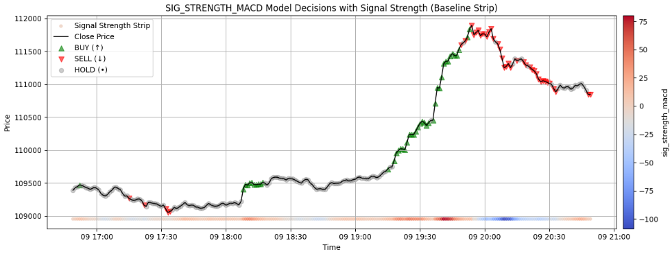

# Silent\_Horizon

> Regime-aware ensemble learning for short-term BTC-USD price direction prediction using XGBoost models and signal-based meta modeling.

> Achieved a Test Accuracy of `72.9 %` against a benchmark model having Test Accuracy of `70.7 %`.
---

### Details

**Use Case:** BTC trade decision engine

**Data Source:** [Kaggle BTC-USD 1-minute OHLCV](https://www.kaggle.com/datasets)

We use high-frequency market data to predict short-term BTC-USD price movement (5-minute horizon) by learning patterns conditioned on market regimes. The final model can output BUY / HOLD / SELL decisions every minute, designed for systematic trading pipelines.

---

### Project Structure

* **Signal Simulation:** Define 9 domain-driven signals that characterize distinct market regimes
* **Regime-Specific Models:** Train one XGBoost model per signal, using only data from strong signal regimes
* **Meta-Model:** Combine predictions of regime models + signal strengths to create an adaptive ensemble model
* **Benchmark:** Compare against a monolithic XGBoost trained on the entire dataset
* **Hyperparameter Optimization:** Final meta-model is tuned using Optuna for improved accuracy

---

### What are `Signal_Simulators`?

Signal simulators are carefully engineered functions that quantify market condition strength. These are normalized metrics derived from technical indicators, used to partition the data into interpretable regimes (low / high signal strength).

We select 9 simulators based on predictive signal quality:

| Signal Name          | Description                                                          |
| -------------------- | -------------------------------------------------------------------- |
| `sig_strength_ma`    | Z-scored distance of price from 20-period moving average             |
| `sig_strength_rsi`   | Normalized deviation of 14-period RSI from neutral (50)              |
| `sig_strength_macd`  | MACD - Signal line, showing directional momentum                     |
| `sig_strength_bb`    | Relative position outside Bollinger Bands, clipped to avoid outliers |
| `sig_strength_obv`   | Z-scored On-Balance Volume, highlighting demand surges               |
| `sig_strength_vwap`  | Price deviation from rolling VWAP                                    |
| `sig_strength_stoch` | %K - %D oscillator difference, for overbought/oversold structure     |
| `sig_strength_roc`   | Normalized Rate of Change of price over 10 bars                      |
| `sig_strength_adx`   | ADX-weighted DI difference, capturing trend strength vs noise        |

Each signal defines a regime: data points in the top or bottom 20% of signal strength are used to train a specialized model.

> There was a potential problem, that there can be a significant number of rows in the market which are not covered in the training data of any of the 9 specialist models.

However we found that the union of the `9` training data covers `99.56%` of the data. So no worries :party:

---

### Modeling Pipeline

1. **Feature Engineering**

   * 40+ handcrafted features from TA-lib and custom indicators
   * Features include trend, momentum, volatility, volume, and structure metrics
   * Includes normalized volume spikes, Bollinger Band compression, VWAP distance, ADX slopes, and more

2. **Target Generation**

   * 3-class labels: SELL (0), HOLD (1), BUY (2)
   * Computed based on log return over the next 5-minute horizon
   * Targets are derived using forward-looking rolling averages to avoid data leakage

3. **Regime Model Training**

   * Each of the 9 signals is used to define a strong regime
   * An XGBoost classifier is trained only on rows where the signal is extreme (top/bottom quantiles)
   * Accuracy, directional bias, and class distribution are tracked per signal model

4. **Meta Model Ensemble**

   * Final input includes:

     * 40 raw features
     * 9 regime model predictions (BUY/HOLD/SELL)
   * Meta-model is trained using XGBoost on this combined 49-dimensional feature set
   * Compared against a benchmark XGBoost model trained directly on signals alone

5. **Hyperparameter Optimization**

   * The final meta-model is tuned using `Optuna`
   * Search space includes `max_depth`, `learning_rate`, `subsample`, `colsample_bytree`, `gamma`, and more
   * 400 trials are conducted using `mlogloss` and `accuracy` as evaluation metrics

---

### Performance Highlights

* Meta-model outperforms benchmark model by capturing regime-conditioned nuances
* Prediction distributions are more stable and interpretable
* Meta-model accuracy improves after Optuna tuning
* The pipeline supports further extensions (e.g., confidence-weighted voting, per-class calibration)

---

### Visual Output

A typical output from one of the regime models (e.g., MACD-based) is shown below.

---

---

The plot illustrates:

* Black line: price
* Green triangles: BUY signals
* Red triangles: SELL signals
* Gray circles: HOLD (no action)
* Signal strength hue (plotted as horizontal intensity at the bottom)

This visual representation confirms the model’s ability to react to high-confidence signals.

---

### Reproducibility and Deployment

* All models are stored using `joblib`
* Final model is saved at `saved_models/best_meta_model.pkl`
* Configurable for real-time prediction via sliding windows
* Easily extendable to include new signals or retrain on fresh data

---
